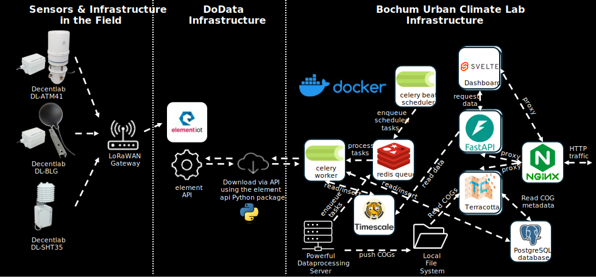

# System Design

The system consists of three major Parts, The sensor-infrastructure in the field, the
IoT server-infrastructure for retrieving the measured data, the server-infrastructure
for managing, processing, and providing the data.

## Sensor infrastructure

Three types of sensors are deployed:

- [Decentlab DL-ATM41 (Generation 1)](https://www.decentlab.com/products/eleven-parameter-weather-station-for-lorawan) -
  a all-in-one weather station providing all common meteorological parameters
- [Decentlab Black Globe DL-BLG](https://www.decentlab.com/products/black-globe-temperature-sensor-for-lorawan) -
  a black globe providing a black globe temperature for calculating $T_{mrt}$
- [Decentlab DL-SHT35](https://www.decentlab.com/products/air-temperature-and-humidity-sensor-with-radiation-shield-for-lorawan) -
  a temperature and relative humidity sensor

The sensors are supposed to send data (instantaneous) measurements every 5 minutes.

## IoT server-infrastructure

The system uses the [Element IoT](https://dew21.element-iot.com/) product to manage the
sensors and gateways. The system also provides an API which is used to retrieve raw data
from the sensors.

## Processing & visualization server-infrastructure

The system that combines all data is the [D2R-API](https://github.com/RUBclim/d2r-api).
It plugs into the Element-IoT system via an API
[element-iot-api](https://github.com/RUBclim/element-iot-api) and retrieves raw data
every 5 minutes, combines data from separate sensors (Black Globe and ATM41) and
calculates derived parameters such as thermal comfort indices using
[thermal-comfort](https://github.com/RUBclim/thermal-comfort).

All data is stored in a central database which also contains views for aggregating the
raw measurements into hourly and daily values per station. In addition it also manages
the complex relations between a stations (a geographical location where measurements are
supposed to be taken), a pool of available sensors (different types and redundant spare
sensors), and deployments (installation of sensors from the pool at a station).

Finally, it offers an [API](https://api.data2resilience.de/docs) for retrieving the data
from the network in near-realtime.

The API is also used for a [dashboard](https://github.com/RUBclim/data-2-resilience/)
which [displays](https://dashboard.data2resilience.de/) the current data.

The final component is a tile-map-server (TMS) that allows displaying the model results
which are ingested from a powerful data-processing server. For this
[terracotta](https://github.com/DHI/terracotta) with a limited subset of endpoints is
used.

